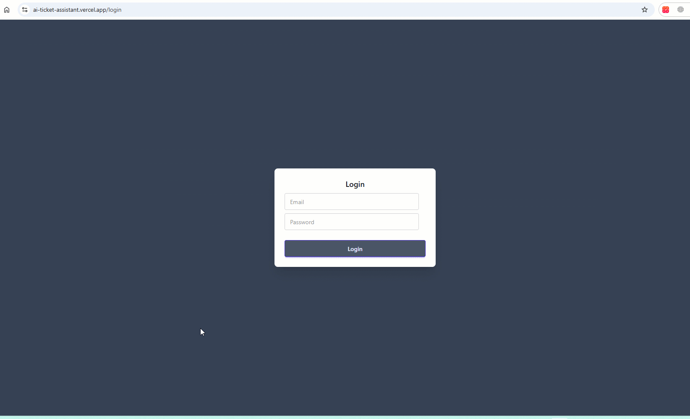

# AI-Powered Ticket Assistant

A smart ticket management system that uses AI to automatically categorize, prioritize, and assign support tickets to the most appropriate moderators.

* Node.js with Express for backend
* MongoDB for database
* Authentication**: JWT for Authentication
* Inngest for Background Jobs
* Google Gemini API for AI Integration
* Nodemailer with Mailtrap for email
* Nodemon for hot reloading 

[Site](https://ai-ticket-assistant.vercel.app/)

## Target Audience

Developers interested in creating applications that use artificial intelligence under the hood.

---



---

## 🚀 Features

- **AI-Powered Ticket Processing**

  - Automatic ticket categorization
  - Smart priority assignment
  - Skill-based moderator matching
  - AI-generated helpful notes for moderators

- **Smart Moderator Assignment**

  - Automatic matching of tickets to moderators based on skills
  - Fallback to admin assignment if no matching moderator found
  - Skill-based routing system

- **User Management**

  - Role-based access control (User, Moderator, Admin)
  - Skill management for moderators
  - User authentication with JWT

- **Background Processing**
  - Event-driven architecture using Inngest
  - Automated email notifications
  - Asynchronous ticket processing


## ⚙️ Installation

1. **Clone the repository**

   ```bash
   git clone <repository-url>
   cd ai-ticket-assistant
   ```

2. **Install dependencies**

   ```bash
   npm install
   ```

3. **Environment Setup**
   Create a `.env` file in the root directory with the following variables:

   ```env
   # MongoDB
   MONGO_URI=your_mongodb_uri

   # JWT
   JWT_SECRET=your_jwt_secret

   # Email (Mailtrap)
   MAILTRAP_SMTP_HOST=your_mailtrap_host
   MAILTRAP_SMTP_PORT=your_mailtrap_port
   MAILTRAP_SMTP_USER=your_mailtrap_user
   MAILTRAP_SMTP_PASS=your_mailtrap_password

   # AI (Gemini)
   GEMINI_API_KEY=your_gemini_api_key

   # Application
   APP_URL=http://localhost:3000
   ```

## 🚀 Running the Application

1. **Start the backend server**

   ```bash
   cd backend
   npm run dev
   ```

2. **Start the Inngest dev server**
Open new terminal
   ```bash
   cd backend
   npm run inngest-dev
   ```

 3. **Start the frontend server**

   ```bash
   cd frontend
   npm run dev
   ```  

## 📝 API Endpoints

### Authentication

- `POST /api/auth/signup` - Register a new user
- `POST /api/auth/login`  - Login and get JWT token
- `POST /api/auth/logout` - Logout current user

### Tickets

- `POST /api/tickets`    - Create a new ticket
- `GET /api/tickets`     - Get all tickets for logged-in user
- `GET /api/tickets/:id` - Get ticket details

### Admin

- `GET /api/auth/users`        - Get all users (Admin only)
- `POST /api/auth/update-user` - Update user role & skills (Admin only)

## 🔄 Ticket Processing Flow

1. **Ticket Creation**

   - User submits a ticket with title and description
   - System creates initial ticket record

2. **AI Processing**

   - Inngest triggers `on-ticket-created` event
   - AI analyzes ticket content
   - Generates:
     - Required skills
     - Priority level
     - Helpful notes
     - Ticket type

3. **Moderator Assignment**

   - System searches for moderators with matching skills
   - Uses regex-based skill matching
   - Falls back to admin if no match found
   - Updates ticket with assignment

4. **Notification**
   - Sends email to assigned moderator
   - Includes ticket details and AI-generated notes

## 🧪 Testing

1. **Start the Inngest dev server**

   ```bash
   npm run inngest-dev
   ```

   This will start the Inngest development server at http://localhost:8288

2. **Test Ticket Creation**
   ```bash
   curl -X GET http://localhost:3000/api/tickets \
   -H "Content-Type: application/json" \
   -H "Authorization: Bearer YOUR_JWT_TOKEN" \
   -d '{
     "title": "Database Connection Issue",
     "description": "Experiencing intermittent database connection timeouts"
   }'
   ```

## 🔍 Troubleshooting

### Common Issues

1. **Port Conflicts**
   If you see "address already in use" error:

   ```bash
   # Find process using port 8288
   lsof -i :8288
   # Kill the process
   kill -9 <PID>
   ```

2. **AI Processing Errors**

   - Verify GEMINI_API_KEY in .env
   - Check API quota and limits
   - Validate request format

3. **Email Issues**
   - Verify Mailtrap credentials
   - Check SMTP settings
   - Monitor email delivery logs

## 📚 Dependencies

- `@inngest/agent-kit`: ^0.7.3
- `bcrypt`: ^5.1.1
- `cors`: ^2.8.5
- `dotenv`: ^16.5.0
- `express`: ^5.1.0
- `inngest`: ^3.35.0
- `jsonwebtoken`: ^9.0.2
- `mongoose`: ^8.13.2
- `nodemailer`: ^6.10.1


## 🙏 Acknowledgments

- Inngest for background job processing
- Google Gemini for AI capabilities
- Mailtrap for email testing
- MongoDB for database
- [Hitesh Cloudhary](https://www.youtube.com/@HiteshCodeLab)  for inspiration  and invaluable contributions


## Contact:

[][linkedin]

[linkedin]: https://www.linkedin.com/in/sergiy-antonyuk/